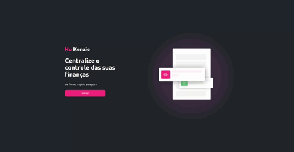

### NuKenzie

## Descrição do projeto

Nu Kenzie é um projeto onde segui um figma desenvolvido na Kenzie Academy, esse projeto tinha como objetivo construir uma pagina de transição bancaria, onde é possivel adicionar e excluir valores. E também conta com uma homePage e uma Dashboard

## Principais desafios

Foi o meu primeiro projeto  em React, aqui desenvolvi components pela primeira vez e criei os primeiros states e também usei o OnClick para transição de paginas! Foi um ótimo aprendizado.

## Principais Técnologias Usadas

- ReactJs
- JavaScript
- CSS 
- HTML

## Como Acessar o Projeto: 

https://react-entrega-s1-nu-kenzie-yasmin.vercel.app/